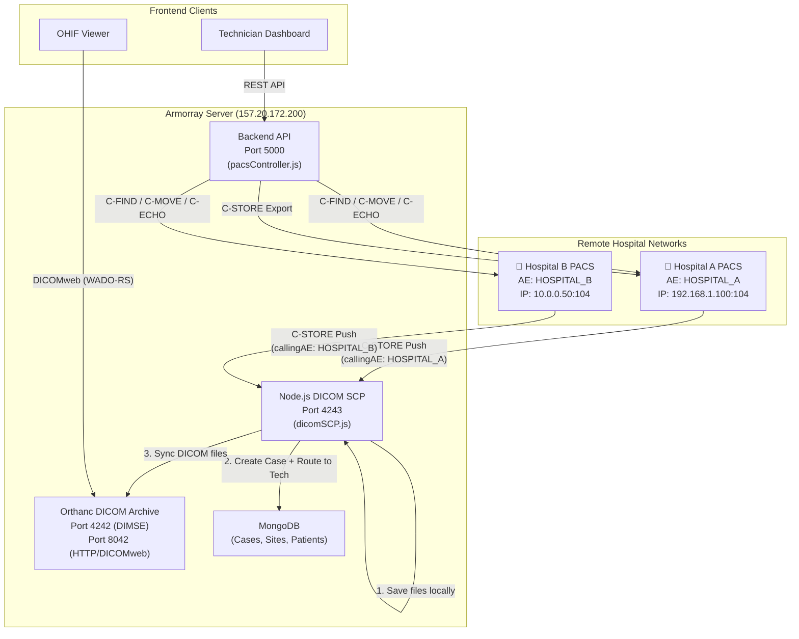
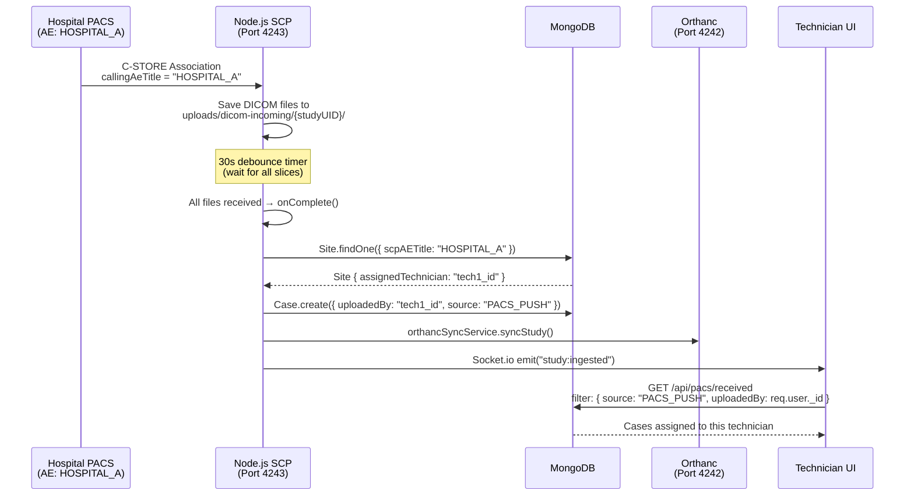
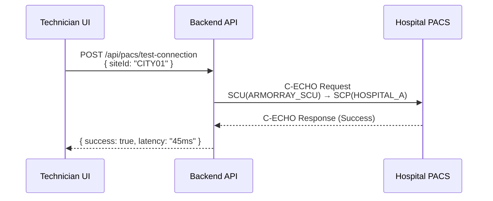
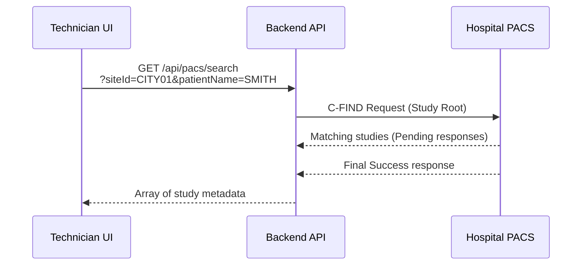
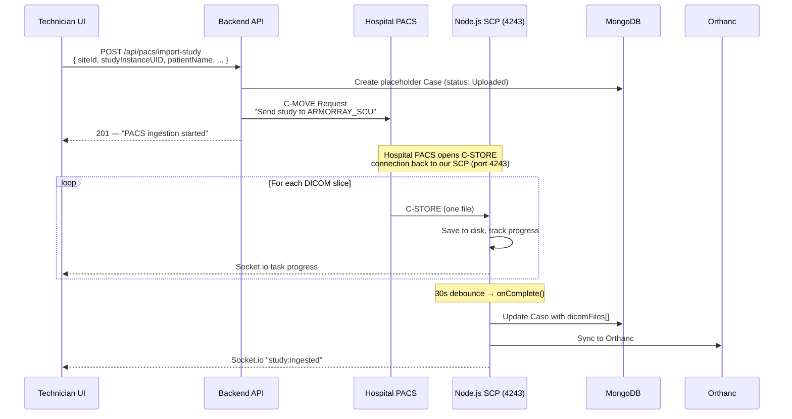
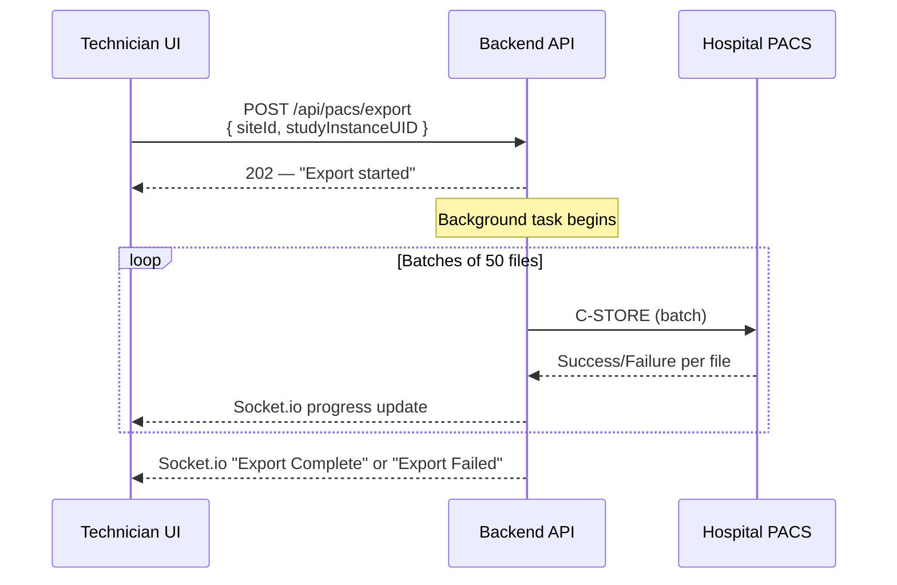
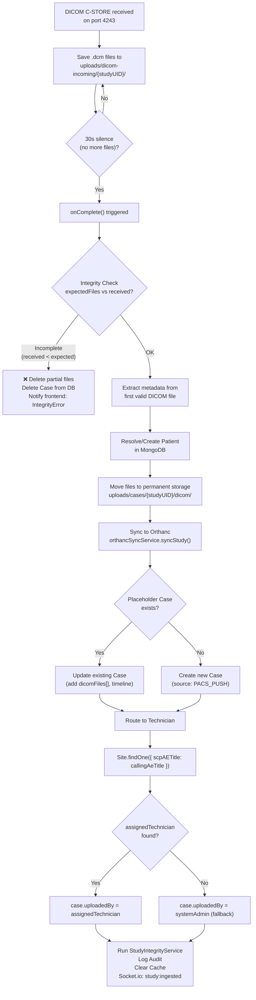
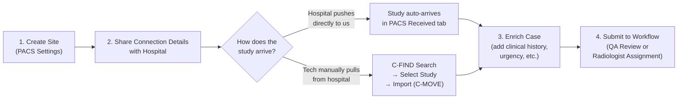

# Armorray PACS Integration — Technical Documentation

> Complete reference for the DICOM/PACS subsystem: architecture, routing, workflows, API, and configuration.

---

## 1. Architecture Overview



---

## 2. The Two DICOM Endpoints

The server runs **two separate** DICOM listeners. Understanding the difference is critical.

| Component | Orthanc | Node.js DICOM SCP |
|---|---|---|
| **File** | Docker container (`orthancteam/orthanc`) | `backend/config/dicomSCP.js` |
| **Port** | `4242` (DIMSE) / `8042` (HTTP) | `4243` |
| **AE Title** | `ORTHANC` | Accepts any |
| **Purpose** | Image archive & DICOMweb server for OHIF Viewer | Smart intake pipeline — routing, case creation, technician assignment |
| **Knows about Cases?** | ❌ No | ✅ Yes |
| **Knows about Technicians?** | ❌ No | ✅ Yes |
| **Creates MongoDB records?** | ❌ No | ✅ Yes |

> [!IMPORTANT]
> **Hospital PACS must send studies to port 4243 (the Node.js SCP), NOT port 4242 (Orthanc).**
> If studies are sent directly to Orthanc, no Case is created, no technician is assigned, and the study is invisible to the application workflow.

---

## 3. Technician Routing — How Studies Reach the Right Inbox

### 3.1 The Routing Chain



### 3.2 How the Matching Works

The routing is based on the **hospital's AE title** (the identity the remote PACS announces about itself), NOT the technician's chosen local AE title.

```
callingAeTitle (from DICOM association)
        ↓
Site.findOne({ scpAETitle: callingAeTitle })
        ↓
site.assignedTechnician → set as case.uploadedBy
        ↓
getPacsReceived() filters: { uploadedBy: req.user._id }
```

**Key fields in the Site model:**

| Field | Meaning | Example | Used For |
|---|---|---|---|
| `scpAETitle` | The **hospital's** PACS AE title | `HOSPITAL_A` | Routing incoming studies |
| `scuAETitle` | Our server's outbound AE title | `ARMORRAY_SCU` | C-FIND, C-MOVE, C-ECHO |
| `scuIP` | Our server's IP | `157.20.172.200` | Told to hospital for C-MOVE callbacks |
| `scuPort` | Our SCP listener port | `4243` | Told to hospital for C-MOVE callbacks |
| `assignedTechnician` | The technician who owns this site | ObjectId ref → User | Auto-set to the creating user |

### 3.3 What the Technician Tells the Hospital

When a technician creates a site and wants the hospital to push studies to them, they share:

```
AE Title:  (any — our SCP accepts all)
IP:        157.20.172.200
Port:      4243
```

The hospital configures their PACS to send to this endpoint. When the hospital PACS sends a study, it identifies itself with its own AE title (e.g., `HOSPITAL_A`). Our SCP matches that against the `scpAETitle` field in the Site collection to find the correct technician.

### 3.4 AE Title Uniqueness

> [!WARNING]
> The `scpAETitle` field currently has **no unique constraint**. If two technicians register the same hospital AE title, `findOne()` returns whichever MongoDB finds first — leading to unpredictable routing. A unique index on `scpAETitle` is recommended.

---

## 4. DICOM Operations

### 4.1 C-ECHO (Connectivity Test)



- **Purpose:** Verify DICOM connectivity (AE title, IP, port all correct)
- **Route:** `POST /api/pacs/test-connection`
- **Access:** Technician, Admin
- **File:** `dicomService.js → cEcho()`

### 4.2 C-FIND (Study Search)



- **Purpose:** Search for studies on the remote PACS
- **Route:** `GET /api/pacs/search`
- **Query params:** `siteId` (required), `patientId`, `patientName`, `accessionNumber`, `studyDate`
- **Access:** Technician, Admin
- **File:** `dicomService.js → cFind()`

### 4.3 C-MOVE (Study Import / Pull)



- **Purpose:** Pull a study from the remote PACS to our server
- **Routes:**
  - `POST /api/pacs/import` — Raw C-MOVE (no placeholder case)
  - `POST /api/pacs/import-study` — Full wizard (creates placeholder case + C-MOVE)
- **Access:** Technician, Admin
- **File:** `dicomService.js → cMove()`, `pacsController.js → importStudyFromPACS()`

### 4.4 C-STORE Export (Study Push to Hospital)



- **Purpose:** Send DICOM files from our server to a remote PACS
- **Route:** `POST /api/pacs/export` (multipart — can include uploaded files)
- **Access:** Technician, Admin
- **Batching:** Files are split into groups of 50 for reliability
- **Retries:** Up to 4 attempts per batch with exponential backoff
- **File:** `dicomService.js → cStore()`

---

## 5. Inbound Study Processing Pipeline

When a study arrives at the Node.js SCP (port 4243), the following pipeline executes:



---

## 6. Site Model Schema

**File:** `backend/models/Site.js`

```javascript
{
    name:                String,    // Display name (unique) — e.g., "City Hospital PACS"
    siteId:              String,    // Unique code — e.g., "CITY01"

    // Remote PACS Server (SCP — the hospital)
    scpAETitle:          String,    // Hospital's AE title — e.g., "HOSPITAL_A"
    scpIP:               String,    // Hospital's IP — e.g., "192.168.1.100"
    scpPort:             Number,    // Hospital's port — e.g., 104

    // Our Server (SCU — our outbound identity)
    scuAETitle:          String,    // Our AE title — e.g., "ARMORRAY_SCU"
    scuIP:               String,    // Our IP — e.g., "157.20.172.200"
    scuPort:             Number,    // Our SCP port — 4243

    // Routing
    assignedTechnician:  ObjectId,  // ref → User (auto-set to creating user)

    // Metadata
    isActive:            Boolean,
    lastPing:            Date,
    createdBy:           ObjectId,
}
```

---

## 7. API Reference

| Method | Route | Access | Description |
|---|---|---|---|
| `GET` | `/api/pacs/sites` | Tech, Admin, QA | List all active sites |
| `POST` | `/api/pacs/sites` | Tech, Admin | Create a new site (auto-assigns technician) |
| `PUT` | `/api/pacs/sites/:siteId` | Tech, Admin | Update site configuration |
| `DELETE` | `/api/pacs/sites/:siteId` | Tech, Admin | Soft-delete (deactivate) a site |
| `POST` | `/api/pacs/test-connection` | Tech, Admin | C-ECHO connectivity test |
| `GET` | `/api/pacs/search` | Tech, Admin | C-FIND study search on remote PACS |
| `POST` | `/api/pacs/import` | Tech, Admin | Raw C-MOVE (no case creation) |
| `POST` | `/api/pacs/import-study` | Tech, Admin | Full import wizard (case + C-MOVE) |
| `POST` | `/api/pacs/export` | Tech, Admin | C-STORE export to remote PACS |
| `GET` | `/api/pacs/server-info` | Tech, Admin | Get server IP and SCP port |
| `GET` | `/api/pacs/received` | Tech, Admin | List auto-received PACS_PUSH cases |
| `GET` | `/api/pacs/scp-status` | Tech, Admin | SCP listener status + live incoming |

---

## 8. Configuration Files

### 8.1 Orthanc (`orthanc.json`)

```json
{
    "AuthenticationEnabled": false,
    "RemoteAccessAllowed": true,
    "DicomAlwaysAllowEcho": true,
    "DicomAlwaysAllowStore": true,
    "DicomAlwaysAllowFind": true,
    "DicomAlwaysAllowGet": true,
    "DicomWeb": {
        "Enable": true,
        "Root": "/dicom-web/"
    },
    "DicomModalities": {
        "MY_RADIOLOGY_SCU": ["MY_RADIOLOGY_SCU", "192.168.1.7", 4243]
    }
}
```

### 8.2 Backend Environment Variables

| Variable | Default | Description |
|---|---|---|
| `DICOM_SCU_PORT` | `4243` | Port the Node.js SCP listens on |
| `DICOM_INCOMING_DIR` | `./uploads/dicom-incoming` | Temp directory for incoming files |
| `ORTHANC_URL` | `http://localhost:8042` | Orthanc HTTP API endpoint |
| `ORTHANC_USER` | `orthanc` | Orthanc HTTP basic auth username |
| `ORTHANC_PASSWORD` | `orthanc` | Orthanc HTTP basic auth password |

### 8.3 OHIF Viewer Config

The viewer connects to Orthanc via DICOMweb. The `requestTransferSyntaxUID` setting forces server-side transcoding of compressed images (J2K) to prevent browser memory crashes.

```javascript
// config/armorray-production.js
configuration: {
    wadoUriRoot: '/dicom-web',
    qidoRoot: '/dicom-web',
    wadoRoot: '/dicom-web',
    imageRendering: 'wadors',
    requestTransferSyntaxUID: '1.2.840.10008.1.2.1', // Explicit VR Little Endian
}
```

---

## 9. Docker Setup

```bash
# Orthanc container
docker run -d \
  --name orthanc_engine \
  -p 4242:4242 \
  -p 8042:8042 \
  -v ./orthanc.json:/etc/orthanc/orthanc.json \
  -v orthanc-data:/var/lib/orthanc/db \
  orthancteam/orthanc:latest

# The Node.js SCP runs as part of the backend (not a separate container)
# Started in server.js via: startDicomSCP()
```

---

## 10. Technician Workflow Summary



### Step-by-Step

1. **Create Site:** Technician configures the hospital's PACS credentials (AE title, IP, port) and their local SCU identity. The system auto-assigns them as the owner.

2. **Share Details:** Technician tells the hospital: *"Send studies to IP 157.20.172.200, port 4243."*

3. **Receive Studies:** Either automatically (hospital pushes) or manually (technician uses C-FIND + C-MOVE to pull).

4. **Enrich:** Add clinical history, indication, urgency, and verify patient demographics.

5. **Submit:** Push the case into the radiology workflow for QA review or direct radiologist assignment.

---

## 11. Known Gaps & Recommendations

| # | Gap | Impact | Recommendation |
|---|---|---|---|
| 1 | `scpAETitle` has no unique constraint | Two technicians could register the same hospital AE title, causing unpredictable routing | Add `unique: true` to `scpAETitle` in Site model |
| 2 | No technician limit on site creation | A single technician could create unlimited sites | Consider adding a per-user site limit or admin approval |
| 3 | Orthanc auth is disabled in production | Anyone with network access to port 8042 can access all DICOM data | Enable `AuthenticationEnabled: true` in `orthanc.json` |
| 4 | SCP accepts any called AE title | Any device on the network can push studies | Consider validating the called AE title against a whitelist |

---

## 12. Glossary

| Term | Meaning |
|---|---|
| **AE Title** | Application Entity Title — a unique 16-character identifier for a DICOM node |
| **SCP** | Service Class Provider — the server that accepts/stores incoming DICOM data |
| **SCU** | Service Class User — the client that initiates DICOM operations |
| **C-ECHO** | DICOM ping — verifies connectivity between two DICOM nodes |
| **C-FIND** | Query operation — search for studies/series/instances on a remote PACS |
| **C-MOVE** | Retrieve operation — instructs a remote PACS to send a study to a specified destination |
| **C-STORE** | Store operation — directly transmit DICOM files to a remote node |
| **DIMSE** | DICOM Message Service Element — the traditional binary DICOM network protocol |
| **DICOMweb** | RESTful HTTP-based DICOM services (WADO-RS, STOW-RS, QIDO-RS) |
| **WADO-RS** | Web Access to DICOM Objects by RESTful Services — used by OHIF to fetch images |
| **Transfer Syntax** | Encoding format for DICOM pixel data (e.g., JPEG 2000, Explicit VR Little Endian) |
| **Orthanc** | Open-source DICOM server used as the image archive in this project |
