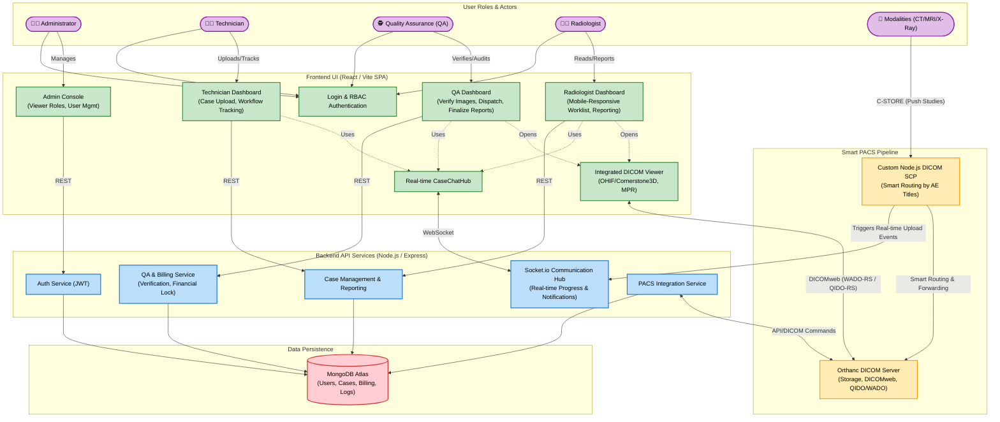
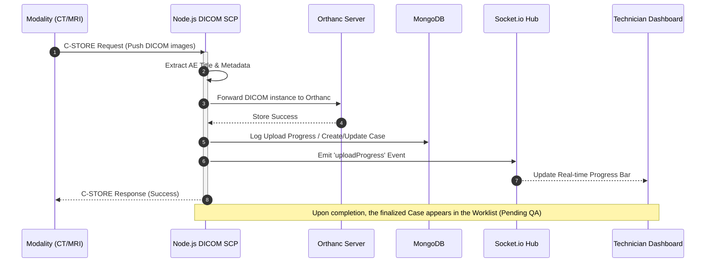
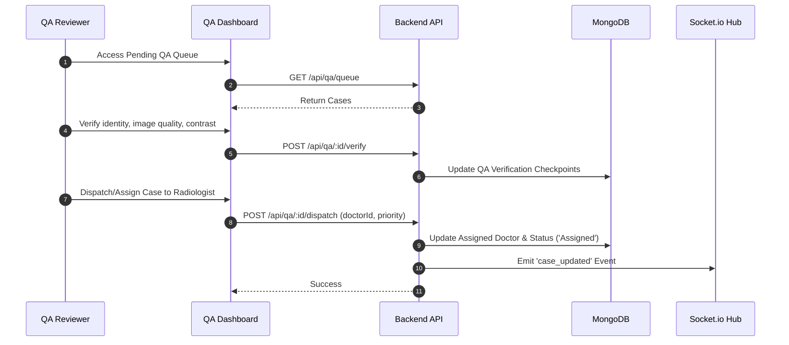
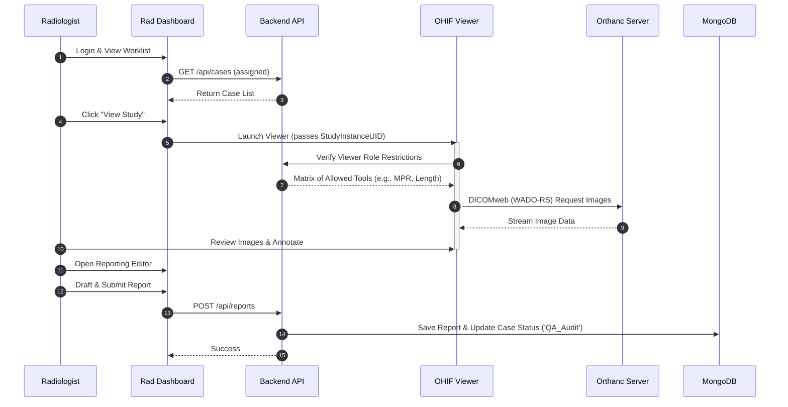
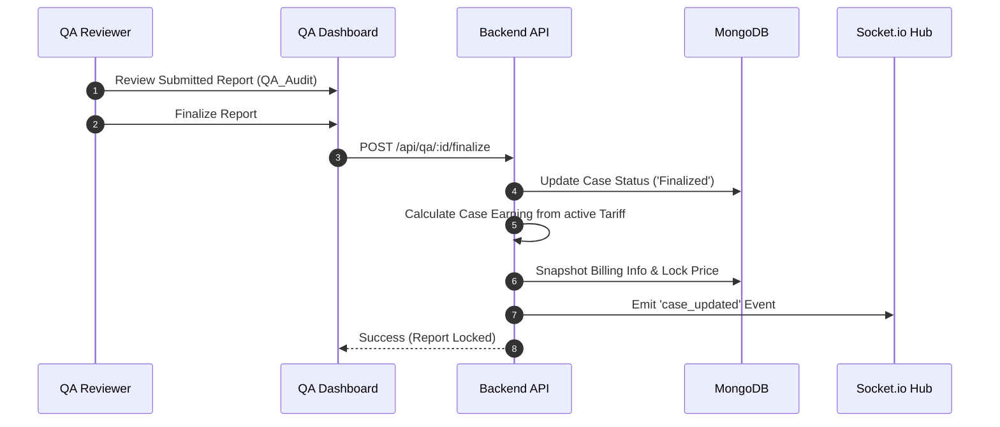
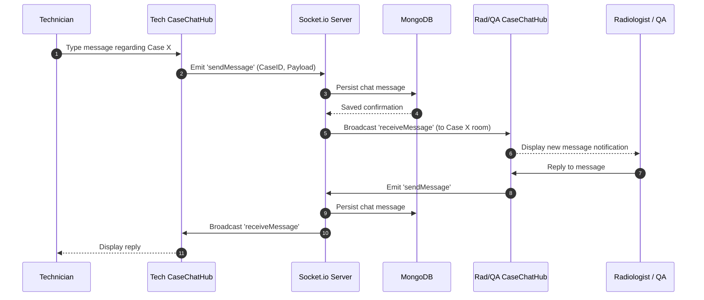
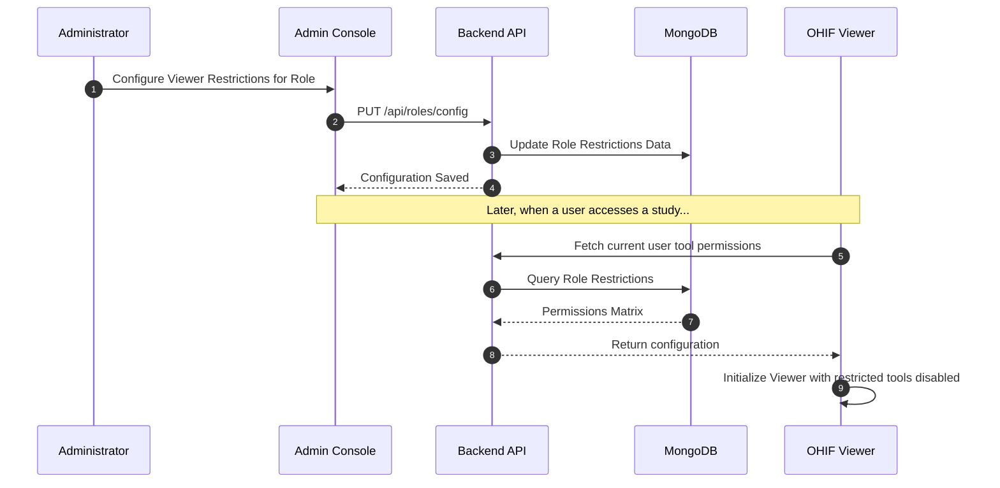

# Armorray Radiology Platform - Development & Architecture Blueprint

**Objective:** This document serves as the primary technical specification and requirement blueprint for the development team. It outlines the system architecture, core modules, and data flows that the team needs to build for the Armorray Radiology Platform.

---

## 1. Project Overview
We are building a robust, web-based Radiology platform designed to ingest DICOM images directly from hospital modalities, route them intelligently, and provide a seamless diagnostic workflow for technicians, radiologists, and QA teams. The platform includes a zero-footprint diagnostic viewer, real-time collaboration tools, strict role-based access control, and financial billing snapshots.

---

## 2. High-Level Architecture Diagram
The following Mermaid diagram illustrates the target architecture the team needs to implement. It covers the interactions between the frontend SPA, the backend API services, and the custom PACS pipeline.

---

## 3. Core Modules to Build

### 👥 1. Frontend: Role-Based Portals (React/Vite)
- **Administrator Console**: Build an interface to manage user roles, system configurations, and viewer role restrictions. 
- **Technician Dashboard**: Build a workflow tracker for technicians to upload cases, monitor ingestion status, and assign studies. Must include a fully mobile-responsive UI with a real-time `CaseChatHub`.
- **QA Dashboard**: Build a portal for the Quality Assurance team to verify patient/image data, assign (dispatch) studies to doctors, request corrections, and finalize the financial billing locks for completed reports.
- **Radiologist Dashboard**: Build a high-density, touch-optimized clinical worklist. Must allow radiologists to review their assigned cases, communicate with technicians/QA, draft final reports, and launch the DICOM viewer.

### 🖼️ 2. Integrated DICOM Viewer
- **Implementation**: Integrate the OHIF Viewer with Cornerstone3D within our React application.
- **Requirements**: Progressive loading, Multi-Planar Reconstruction (MPR), and Zero-Footprint deployment.
- **Security Requirement**: Implement role-based tool restrictions dynamically injected from the backend (e.g., locking advanced measurement tools for basic roles), including a fail-open safety mechanism to prevent configuration tampering.

### 📡 3. Smart PACS Workflow Management
- **Node.js DICOM SCP**: Build a custom DICOM receiver listener using Node.js that accepts `C-STORE` pushes directly from hospital modalities.
- **Intelligent Routing**: Write logic to route the incoming study to the appropriate technician/clinic based on the incoming **AE Title**.
- **Orthanc DICOM Server**: Deploy and connect an Orthanc server to act as our primary storage, serving images to the OHIF viewer using standard `DICOMweb` (WADO-RS / QIDO-RS) protocols.

### ⚡ 4. Real-Time Socket Communication
- **Socket.io Hub**: Implement a WebSocket layer to push live updates across the platform without page refreshes.
- **Requirements**: Real-time progress bars for heavy DICOM uploads (ingestion progress) and instant chat messaging (CaseChatHub) between Technicians, QA, and Radiologists.

### 🗄️ 5. Backend API & Data Persistence
- **Stack**: Build the core APIs using Node.js & Express.
- **Database**: Use MongoDB Atlas for schema-flexible storage of users, cases, reporting metadata, billing/tariffs snapshots, chat logs, and configuration matrices.

---

## 4. Detailed Implementation Workflows (HLD)

The team must implement the following exact workflows. These Sequence Diagrams break down the processes step-by-step.

### A. DICOM Ingestion & Smart Routing Flow
**Goal for the team:** Build the pipeline that automatically catches a DICOM push from a hospital, saves it to Orthanc, and updates the technician's UI in real-time.

### B. QA Verification & Dispatch Flow
**Goal for the team:** Build the pre-read workflow where a QA verifies the incoming study quality before assigning it to a radiologist.

### C. Radiologist Diagnostic Flow
**Goal for the team:** Build the diagnostic flow. A radiologist clicks a case, the viewer loads the images securely, and they write their report (submitting it to QA Audit).

### D. QA Finalization & Billing Snapshot Flow
**Goal for the team:** Build the final post-read workflow. QA checks the radiologist's report, finalizes it, and the system locks the financial price based on the active tariff.

### E. Real-Time Collaboration Flow (CaseChatHub)
**Goal for the team:** Implement a chat hub tied to specific clinical cases, enabling immediate communication.

### F. Admin Access Control & Viewer Restrictions Flow
**Goal for the team:** Build the configuration interface and logic that controls which features are enabled in the OHIF viewer based on the user's role.

