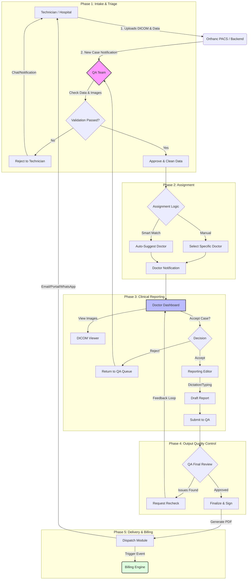
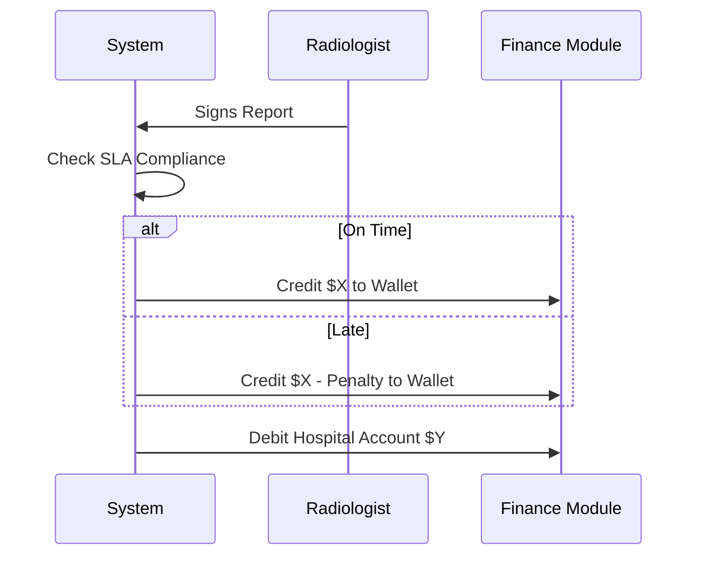

# Radiology Platform - Master System Architecture & Operational Workflows

> **Version:** 1.0 (Production Ready)  
> **Status:** Approved for Implementation  
> **Classification:** Internal Technical Documentation

---

## 1. Executive Summary
This document serves as the **Single Source of Truth** for the Radiology Platform. It details the complete lifecycle of a radiology case—from image acquisition by the technician to the delivery of the final signed report to the client. It synthesizes the responsibilities of all system actors: **Admins, Quality Analysts (QA), Radiologists, and Technicians**.

The platform is designed to be a **high-throughput, QA-centric teleradiology solution** that ensures clinical accuracy, rapid turnaround times (TAT), and robust financial tracking.

---

## 2. Core Entities & Role Architecture

### 2.1. User Roles

| Role | Primary Responsibility | Key Capabilities |
| :--- | :--- | :--- |
| **Admin** | System Governance | User management, billing configuration, compliance monitoring, master override. |
| **Quality Analyst (QA)** | Traffic Control & Quality | Validates patient data/images, assigns doctors, reviews final reports, manages disputes. **The central hub of the workflow.** |
| **Radiologist** | Clinical Interpretation | Views DICOM images, dictates/types findings, signs reports. |
| **Technician** | Data Ingestion | Performs scans, acts as the bridge between modalities (CT/MRI) and the cloud platform. |
| **Hospital/Center** | Service Consumer | Origin of the patient; recipient of the final report and invoice. |

### 2.2. Data Entities
*   **Study**: A collection of DICOM images (Series/Instances) linked to a Patient.
*   **Case**: The administrative wrapper around a Study, tracking its status (e.g., `New`, `Assigned`, `Reported`, `Finalized`).
*   **Report**: The clinical output (PDF), versioned and legally signed.
*   **Ticket/Query**: Communication capability for problem resolution (e.g., "Blurry Images").

---

## 3. High-Level System Workflow
The following diagram illustrates the "Happy Path" and primary exception loops.

---

## 4. Detailed Operational Procedures

### 4.1. Phase 1: Study Intake & Pre-Reporting QA
**Objective**: Ensure only clinically valid, complete data reaches the doctor.

1.  **Ingestion**:
    *   Technician pushes images from modality to Local Orthanc or directly to Cloud.
    *   Technician fills `Patient Demographics Form` (Name, Age, Sex, History).
    *   **System Action**: Creates a unique `CaseID`. Integration matches DICOM tags with form data.

2.  **QA Validation (The Gatekeeper)**:
    *   QA receives a real-time alert (Sound + Toast).
    *   **Verification Checklist**:
        *   Does Patient Name match Hospital records?
        *   Are all required sequences (Series) present?
        *   Is there motion blur or artifacting?
        *   Is the Clinical History sufficient? (e.g., "Headache" is vague; "Right-sided weakness, 3 days" is good).
    *   **AI Augmentation**: System auto-scans for missing series or "Blurry" tags (future state).

3.  **Rejection Protocol**:
    *   If invalid, QA clicks **Reject**.
    *   Selects reason: *e.g., "Missing T2 Flare sequence", "Wrong Patient Name".*
    *   **System Action**: Case status -> `Rejected`. Technician notified immediately via WhatsApp/App.

### 4.2. Phase 2: Intelligent Doctor Assignment
**Objective**: Match the right case to the right specialist at the right time.

1.  **Availability Check**:
    *   System filters doctors by: `Online Status`, `Modality Privilege` (e.g., Neuro vs. MSK), and `Current Load`.
2.  **Assignment**:
    *   **Manual**: QA selects Dr. X from the list.
    *   **Smart Match**: Algorithm suggests Dr. Y based on "Fastest TAT" or "Sub-specialty Match".
3.  **Notification & Handshake**:
    *   Doctor receives: "New MRI Brain Case from City Hospital".
    *   Doctor MUST `Acknowledge/Open` the case within *X minutes* (SLA trigger). If not, case auto-bounces back to QA.

### 4.3. Phase 3: Reporting & Viewer Integration
**Objective**: Provide a seamless, tool-rich environment for diagnosis.

1.  **DICOM Viewer (OHIF/Cornerstone)**:
    *   **Hanging Protocols**: Auto-arrange images (e.g., 2x2 layout for MRI Brain).
    *   **Tools**: Window/Level, Pan, Zoom, MPR (Multi-Planar Reconstruction), Measurements.
    *   **Key Images**: Radiologist marks key pathology. These images are tagged to be appended to the final PDF.

2.  **Reporting Editor**:
    *   **Dictation**: Integrated voice-to-text (Nuance/Google/Browser API).
    *   **Templates**: Doctor types `.norm` -> auto-expands to "Normal Brain MRI text...".
    *   **Macros**: Dynamic insertion of measurements.

3.  **Submission**:
    *   **Draft**: Auto-saves every 30 seconds.
    *   **Final Submit**: Doctor electronically signs. Status -> `QA Review`.

### 4.4. Phase 4: Post-Reporting QA & Delivery
**Objective**: Catch typos, mismatches, and critical alerts before the client sees the report.

1.  **QA Final Check**:
    *   QA reads the report alongside the images.
    *   **Sanity Check**: *Report says "Left side tumor" but images show "Right side"?* -> **CRITICAL CATCH**.
2.  **Recheck Loop**:
    *   QA sends "Query to Doctor": *"Please confirm side, looks like Right."*
    *   Doctor gets "Recheck Requested" alert. Edits and resubmits.
3.  **Dispatch**:
    *   Once QA approves, system generating the **Final PDF**.
    *   **Header/Footer**: Applies specific Hospital branding.
    *   **Delivery**: Auto-email to Referring Physician; WhatsApp link to Patient (optional); Portal update for Hospital.

---

## 5. Billing & Financial Engine
The platform includes a granular billing system triggered by workflow events.

### 5.1. Client Billing (Invoicing)
*   **Trigger**: Final Report Dispatch.
*   **Calculation**: `Base Rate (Modality)` + `Emergency Surcharge` + `Contrast Fee`.
*   **Logic**:
    *   *Hospital A* has a contract: CT Brain = $500.
    *   *Hospital B* (Walk-in): CT Brain = $700.
*   **Output**: Monthly Statement generates on the 1st of the month.

### 5.2. Radiologist Payouts
*   **Trigger**: Report Finalization.
*   **Calculation**: `Base Rate` x `Revenue Share %` OR `Fixed Fee per Case`.
*   **Deductions**: Penalties for SLA breaches (configurable).
*   **Visibility**: Doctors see a "Live Earnings" ticker on their dashboard.

---

## 6. Communication & Notifications Architecture
Efficient comms reduce TAT.

| Channel | Trigger | Recipient | Content |
| :--- | :--- | :--- | :--- |
| **In-App Toast**| New Case Uploaded | QA | "New CT Abdomen from Apollo Center" |
| **Push/Mobile** | Case Assigned | Doctor | "Action Required: Case #1234 assigned" |
| **Email** | Report Finalized | Hospital | "Report Ready: Patient John Doe" |
| **WhatsApp** | Critical Result | Ref. Physician | "URGENT: Hemorrhage detected for Patient X" |
| **Chat** | Query | QA/Tech/Doc | Context-aware chat linked to specific Case ID |

---

## 7. Technical Integration & Compliance

### 7.1. PACS Integration (Orthanc)
*   **Proxy Strategy**: Frontend connects to Backend -> Backend proxies to Orthanc.
*   **Security**: No direct exposure of Orthanc ports to the public internet.
*   **Large File Handling**:
    *   Use `supportsWildcard: true` for broad searches (see Technical FAQ).
    *   MPR Rendering: Use `useNorm16Texture` or `preferSizeOverAccuracy` config to handle memory pressure for large CT stacks.

### 7.2. Standardization (OHIF Parity)
*   **Metadata**: Strict enforcement of `StudyInstanceUID`, `SeriesInstanceUID`, `SOPInstanceUID`.
*   **Compression**: Transcoding to specific transfer syntaxes (e.g., Explicit VR Little Endian) if needed for browser compatibility.

### 7.3. Medico-Legal Locking
*   **Lock Event**: When status matches `Finalized`.
*   **Immutability**: Report text and Pixel Data become Read-Only.
*   **Amendment**: Requires Admin intervention to "Unlock" -> creates a new version (V2). Original V1 is retained for audit.

---

## 8. Admin & Governance Dashboard
The control center for the platform owner.

*   **SLA Monitor**: Live heatmap of cases nearing TAT breach (Green -> Yellow -> Red).
*   **Audit Logs**: "Who did what, when". Every view, edit, download is logged with IP and Timestamp.
*   **Master Config**:
    *   Add/Remove Modalities.
    *   Edit Pricing Tables.
    *   Create New Hospital Tenants.

---
**End of Document**
